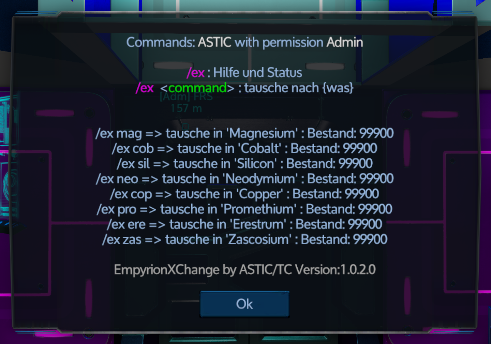
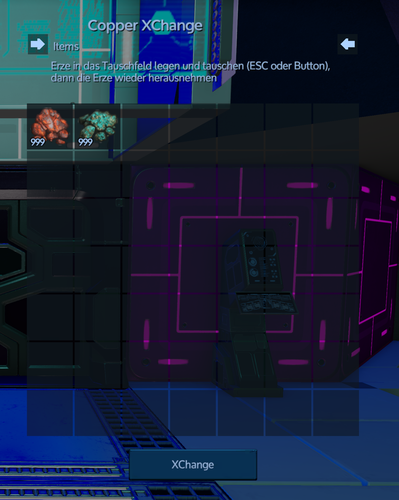
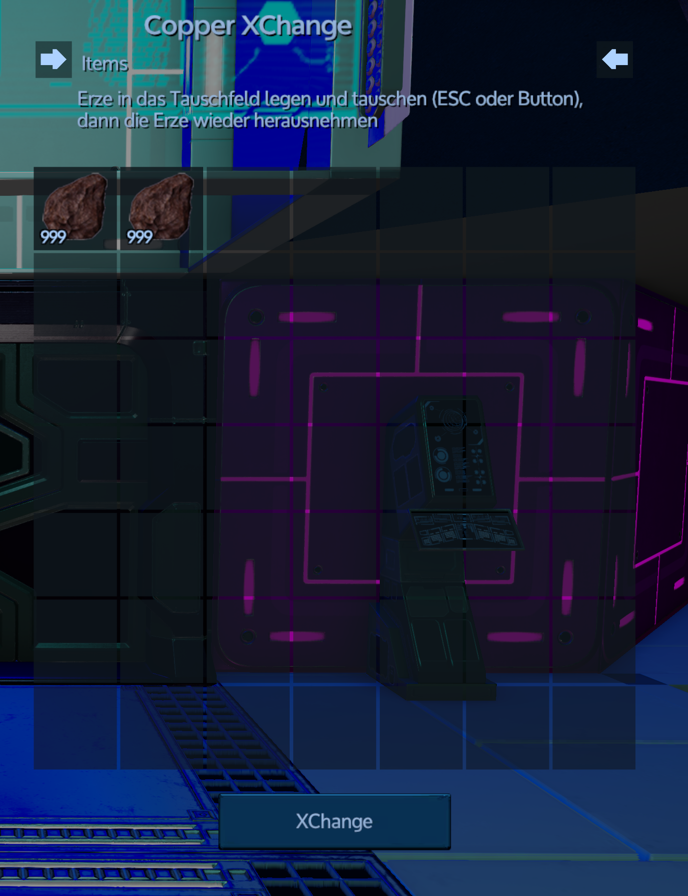

# EmpyrionXChange

## Installation
Sie können diesen Mod direkt mit dem MOD-Manager von EWA (Empyrion Web Access) laden.  
Ohne den EWA funktioniert der Mod nur innerhalb des EmpyrionModHost

## Konfigurieren Sie Ihre Tauschitems
Nach der Installation und dem Start des Mods ist hier eine Beispielkonfiguration, die angepasst werden kann.
[SaveGamePath]\Mods\EmpyrionXChange\XChangeItems.json

## Verwendungszweck
* \ex in fraktion Chat für Hilfe und Lagerbestand
* \ex [itemShortName] zum Tauschen von Items zu diesem [itemShortName] Item

## Beispiel: Erztauschbörse
Die Erzetauschbörse erreicht man über den Fraktionschatbefehl "/ex"
dieser Informiert über die Erze welche getauscht werden können und wie viel Erze zum Tausch vorhanden sind.

Der Tausch läuft dann wie folgt ab (nur im Fraktions-Chat möglich "mit Komma erreichbar"):
* \ex [Erzkürzel] z.B. \ex zas

eingeben und die zu tauschenden Erze in das Tauschfeld legen.
Dann den Tausch per ESC oder den Button bestätigen und alles wieder aus dem Tauschfeld nehmen.

Wenn ein Tausch nicht stattgefunden hatt kann das daran liegen das nicht genügend Erze zum Tausch vorhanden waren oder das 
Erze in das Tauschfeld gelegt wurden die in der Tauschbörse nicht getauscht werden können.

## Bestand und Hilfe
Per Fraktionschat aktivieren "/ex" oder "/ex help"

## Tauschhandel
1. Tauscherz wähen und per Fraktionschat aktivieren "/ex cop"
1. Erze rein und tauschen

1. Getauschte Erze entnehmen

# EmpyrionXChange

## Installation
Your can direct load this mod with the EWA (Empyrion Web Access) MOD manager. 
Without the EWA the mod works only within the EmpyrionModHost

## Config your items
After the installation and the start of the mod is here an example configuration which can be adapted.
[SaveGamePath]\Mods\EmpyrionXChange\XChangeItems.json

## Usage
* \ex in fraction chat fot help and stockinfo
* \ex [itemShortName] for change to this items

